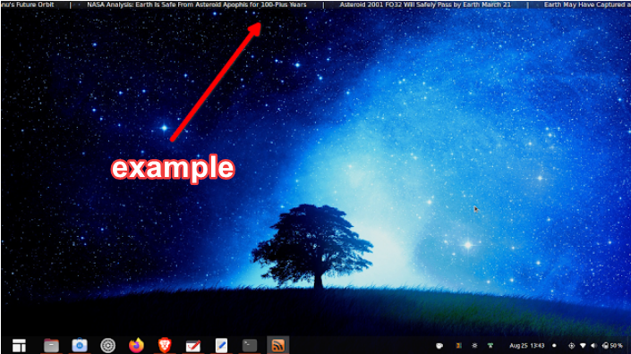

> Note: WIP (untested)

### How to Create a Scrolling RSS Feed for Livestream Lower-third via RTSP
1. Create an Ubuntu Desktop container
2. [Install TICKR](https://open-tickr.net/help.php#building_from_source_howto)

> Tip: You can skip all the following steps by just installing TICKR on you desktop and creating an OBS screen-capture of just the TICKR scrolling headlines. But if you want to have a dedicated URL and use the OBS browser window video source feature, then continue.

4. Add desired RSS feeds to TICKR
5. [Install v4l2loopback](https://github.com/umlaeute/v4l2loopback/)
6. Setup VNC screencapture of TICKR
7. [Self-host a RTSP Stream](https://www.youtube.com/watch?v=0scjy6Zxzwc)
8. Stream VNC feed via RTSP to YouTube
9. Copy YouTube stream and paste the URL into OBS as a [Browser Source](https://i.imgur.com/Qze1D54.png)

### Create a Live VNC Terminal Stock Ticker, Watcher for Livestream
1. Create an Ubuntu Server
2. Install Docker
3. [Install Ticker by achannarasappa](https://github.com/achannarasappa/ticker)
4. Setup VNC video feed
5. [Self-host a RTSP Stream](https://www.youtube.com/watch?v=0scjy6Zxzwc)
6. Stream VNC feed via RTSP to YouTube
7. Copy YouTube stream and paste the URL into OBS as a [Browser Source](https://i.imgur.com/Qze1D54.png)

### Ant Media Server

#### About Ant Media Server
- Ant Media Server is a streaming engine software that provides adaptive, ultra low latency streaming by using WebRTC technology.
- The community edition is free, but has [limited features](https://github.com/ant-media/Ant-Media-Server/wiki/Introduction), such as:
  - 8-12 second latency
  - No Kubernetes scaling
  - No secure streaming (no https)
  - No adaptive bitrate
- This will not be a problem for the simple purpose of a scrolling RSS feed and stock ticker watcher. Besides, who has $100/m for the enterprise services? 

#### Ant Media Install

> Note: Ant Media Server is built on Ubuntu 18.04.

- [Download the latest, stable community edition](https://github.com/ant-media/Ant-Media-Server/releases) zip file (or get the enterprise ver. if you got cash to burn).
- Copy the contents to your Linux server.
