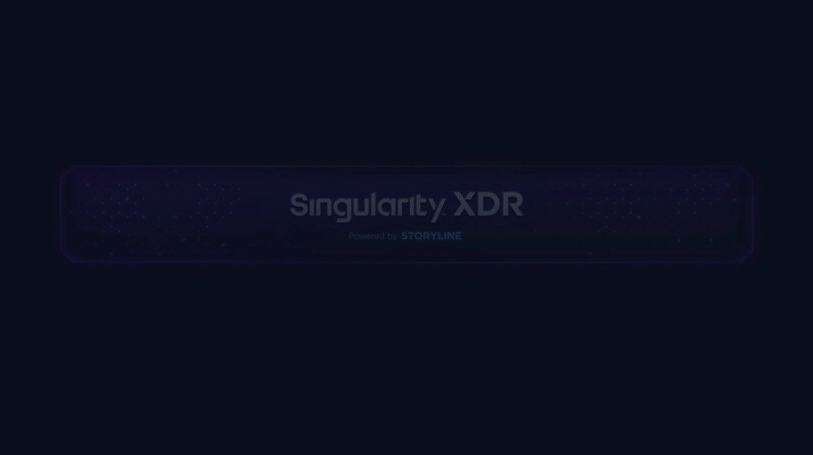

All graphics and conent is intellectual property subject to copyright laws protected via [licensing owned by SentienlOne](https://www.sentinelone.com/legal/). Please do not copy, redistribute, or modify.

# Table of Contents
- [Partner Portal & All Resources](#s1-resources)
- [Why SentinelOne](#why-sentinelone)
- [The XDR Difference](#why-xdr)
- [Threat Services](#threat-services)
- [Selling SentinelOne](#selling-sentinelone)
- [Demo Kit Setup](#demo-toolkit)
- [Deploy SentinelOne](#deploy-s1)
- [Troubleshooting Issues](#troubleshooting)
- [Cybersecuirty Glossary](#cybersecurity-glossary)


SentinelOne encompasses __AI-powered prevention, detection, response, and threat hunting__ across user endpoints, containers, cloud workloads, and IoT devices. Learn more by watching this video of [SentinelOne Explained in 2-mins](https://youtu.be/Fzji8wNJEc4).

For more in-depth look at SentinelOne see the [Basic Technical Sales Pitch](https://i.imgur.com/q38113oezq)

Tomer Weingarten, CEO and Co-Founder, SentinelOne describes S1 functions as follows:

- Find an anomaly
- understand that it's bad
- do it in real-time
- make it happen on the machine
- have no user interaction whatsoever
- stop the threat autonomously
- find the damage that might have been done
- remediate it completely
- roll back all system damages

__The SeninelOne Difference__


# S1 Resources

See the [Sentinel One Partner Portal](https://partners.sentinelone.com/English/#home_login) to get access to Partner Program Guides, Sales Decks, Case Studies, Battle Cards, The Partner Demo Toolkit, and so much more.

__Registering to the Partner Portal__

1. Go to partners.sentinelone.com
1. Use the form on the bottom right to request access from the SentinelOne Channel Team, using your company email address
1. In the Company Selection: choose the company you are an employee of
1. Fill in your applicant information
1. An email with instructions on how to log in to Partner Portal will be sent to you.

> Note: Please check your spam folder for the Partner Portal confirmation email. Have any challenges? Questions? Contact us at channel@sentinelone.com

- Once your account is regsitered and activated, visit [Partner Portal Assets Library](https://partners.sentinelone.com/prm/English/s/assets) for access to all reseller resources.

# Why SentinelOne
[Why S1 Sales Deck - L1](https://partners.sentinelone.com/prm/English/s/assets?id=328616&q=l1)


### Endpoint Technology Evolution


The Two Anti-virus Worlds Converge:
- AV World:
  - McAfee, Cylance, Legacy AV
- EDR (endpoint detection and response):
  - FireEye, CarbonBlack, EDR


- Typically, the __industry landscape for AV and EDR today__ ranges from three different initiatives:
  - __AV +__ : 40% say they have an AV, but they want to improve it
  - __+ / EDR / +__ : 30% say they do _not_ have an EDR, but they want to add one/improve existing EDR.
  - __Converge__ : 30% say they want to merge AV and EDR into one. Convergance is expected to grow as AI-awareness increases.

Discover why customers choose SentinelOne over the following competitors:
- [Why SentinelOne](https://www.sentinelone.com/why-sentinelone/) - SentinelOne is autonomous cybersecurity built for what’s next. Learn more about how we are different
- [SentinelOne Vs CrowdStrike](https://www.sentinelone.com/vs/crowdstrike/) - With the rising speed and complexity of cyber threats, leading enterprises around the globe are leaving CrowdStrike’s human-powered solutions behind for real-time, autonomous cybersecurity. See what’s possible with SentinelOne
- [SentinelOne Vs Microsoft](https://www.sentinelone.com/vs/microsoft/) - Customers choose SentinelOne over Microsoft Defender for Endpoint to protect, detect, and recover from cyber threats
- [SentinelOne Vs Microsoft Defender XDR](https://www.sentinelone.com/vs/microsoft-xdr/) - Customers choose SentinelOne over Microsoft Defender XDR as their Extended Detection Response (XDR) platform
- [SentinelOne Vs McAfee](https://www.sentinelone.com/vs/mcafee/) - Customers choose SentinelOne over McAfee for endpoint & cloud protection, detection, and response
- [SentinelOne Vs Symantec](https://www.sentinelone.com/vs/symantec/) - Customers choose SentinelOne over Symantec by Broadcom for endpoint & cloud protection, detection, and response
- [SentinelOne Vs Carbon Black](https://www.sentinelone.com/vs/carbon-black/) - Customers choose SentinelOne over VMware Carbon Black for endpoint & cloud protection, detection, and response
- [SentinelOne Vs Palo Alto Networks](https://www.sentinelone.com/vs/palo-alto-networks/) - Customers choose SentinelOne over Palo Alto Networks for endpoint & cloud protection, detection, and response
- [SentinelOne Vs Trend Micro](https://www.sentinelone.com/vs/trend-micro/) - Customers prefer SentinelOne over Trend Micro to protect, detect, and recover from cyber threats spanning endpoints and cloud workloads

# Why XDR?
[See S1 PDF for more info](https://assets.sentinelone.com/cybersecurity-industry/cybersecurity-alphabet-soup)

Take the Next Leap in the Evolution of EDR. Extend Beyond the Endpoint With End-to-End Enterprise Visibility, Protection, and Response.
- __See__: Maximize visibility across every corner of the enterprise.
- __Protect__: Protection with unrivaled speed, coverage, and efficiency.
- __Resolve__: Automate response across the entire connected security ecosystem.


### How Is XDR Different From SIEM?
- When we talk about XDR, some people think that we are describing a Security Information & Event Management (SIEM) tool in a different way. But XDR and SIEM are two different things.
- SIEM collects, aggregates, analyzes, and stores large volumes of log data from across the enterprise. SIEM started its journey with a very broad approach: collecting available log and event data from almost any source across the enterprise to be stored for several use cases. These included governance and compliance, rule-based pattern matching, heuristic/ behavioral threat detection like UEBA, and hunting across telemetry sources for IOCs or atomic indicators.
- SIEM tools, however, require a lot of fine-tuning and effort to implement. Security teams can also get overwhelmed by the sheer number of alerts that come from a SIEM, causing the SOC to ignore critical alerts. In addition, even though a SIEM captures data from dozens of sources and sensors, it is still a passive analytical tool that issues alerts.
- The XDR platform aims to solve the challenges of the SIEM tool for effective detection and response to targeted attacks and includes behavior analysis, threat intelligence, behavior profiling, and analytics.

### How Is XDR Different From SOAR?
- Security Orchestration & Automated Response (SOAR) platforms are used by mature security operations teams to construct and run multi-stage playbooks that automate actions across an API-connected ecosystem of security solutions. In contrast, XDR will enable ecosystem integrations via Marketplace and provide mechanisms to automate simple actions against 3rd-party security controls.
- SOAR is complex, costly, and requires a highly mature SOC to implement and maintain partner integrations and playbooks. XDR is meant to be ‘SOAR-lite’: a simple, intuitive, zero-code solution that provides actionability from the XDR platform to connected security tools.

### What Is MXDR?
- Managed Extended Detection and Response (MXDR) extends MDR services across the enterprise to get a fully managed solution that includes security analytics and operations, advanced threat hunting, detection and rapid response across endpoint, network, and cloud environments.
- An MXDR service augments the customer’s XDR capabilities with MDR services for additional monitoring, investigations, threat hunting, and response capabilities.

### Why XDR Gaining Traction?
- XDR is the [all-in-one secuirty package](https://youtu.be/QikuJsgsgxk). XDR replaces siloed security and helps organizations address cybersecurity challenges from a unified standpoint. With a single pool of raw data comprising information from across the entire ecosystem, XDR allows faster, deeper, and more effective threat detection and response than EDR, collecting and collating data from a wider range of sources. 
- XDR provides more visibility and context into threats; incidents that would not otherwise have been addressed before will surface to a higher level of awareness, allowing security teams to remediate and reduce any further impact and minimize the scope of the attack.
- A typical ransomware attack traverses the network, lands in an email inbox, and then attacks the endpoint. Addressing security by looking at each of those independently puts organizations at a disadvantage. XDR integrates disparate security controls to provide automated or one-click response actions across the enterprise security estate such as disabling user access, forcing multi-factor authentication on suspected account compromise, blocking inbound domains and file hashes and more – all via custom rules written by the user or by logic built into the prescriptive response engine.
- This comprehensive visibility leads to several benefits, including:
  - Reducing Mean Time to Detect (MTTD) by correlating across data sources.
  - Reducing Mean Time to Investigate (MTTI) by accelerating triage and reducing time to
investigate and scope.
  - Reducing Mean time to respond (MTTR) by enabling simple, fast, and relevant automation.
  - Improving visibility across the entire security estate.
- Moreover, thanks to AI and automation, XDR helps reduce the burden of manual work on security analysts. An XDR solution can proactively and rapidly detect sophisticated threats, increasing the security or SOC team’s productivity and returning a massive boost in ROI for the organization.

# SentinelOne Product and Services Overview



- Singularity™ Platform Bundles
- Singularity™ XDR Platform - Data Retention and Data Ingest
- SentinelOne Threat Services
- SentinelOne Network Visibility and Control
- SentinelOne Cloud Workload Protection Platform
- SentinelOne Singularity™ Identity
- Mobile Threat Defense (MTD)
- Limitless Integrations
- Other SentinelOne Products and Services

# Threat Services
[Master S1 Service Offering/Overview](https://partners.sentinelone.com/prm/English/s/assets?id=386841)
[Threat Services Data Sheet](https://partners.sentinelone.com/prm/English/s/assets?id=338789&q=threat)
[Sales Deck - L2](https://partners.sentinelone.com/prm/English/s/assets?id=386841)

### ___Singularity_ Top Value Propositions__
  - A single platform with consolidated security functions that make security and IT teams more effective and efficient.
  - Reduce the risk of cyber-attacks disrupting business operations.
  - A strategic partner for customers with a broad portfolio of products and services.
  - Seamlessly integrate with existing security investments to improve ROI.

### Singularity Questions
- __Time to Value__ question: How many technologies do you typically use to achieve resolution? How long does it take?
- __RCA or Root Cause Analysis__ question: "How do you perform event correlation and Root Cause Analysis (RCA)?"
- __Numbers and Diversity__ question: How many agents are you running on the endpoint and what are their roles? Does this vary by the operating system?

### Top Singularity Differences
  - Multi-tenant SaaS platform, with a single resource-efficient agent.
  - Automatically correlate atomic events into the rich story context.
  - Remediate all affected endpoints with a single click.
  - Up to 365 days context retention for all EDR activities.
  - Up level SOC resources to enable proactive threat hunting with automated hunting rules.

## Vigilance and Viglance Pro
[Vigilance Data Sheet](https://assets.sentinelone.com/vdi1/sentinel-one-vigilan?lb-mode=overlay#page=1)


__Vigilance__ is a __Managed Detection and Response (MDR)__ and __Digital Forensics Incident Response (DFIR)__ tool with the following features:

### Vigilance Respond
Managed Detection & Response to augment your security operations. Triage, Resolution, and Escalation when necessary.

### Vigilance Respond PRO
MDR + Digital Forensics & Incident Response form a security safety net. Extended investigation and response, faster SLAs, and direct IR Pro access.


## Watchtower and Watchtower Pro
- [WatchTower Data Sheet](https://assets.sentinelone.com/gss/sentinelone-watchtow?lb-mode=overlay#page=1)
- [WatchTower Monthly Report](https://www.sentinelone.com/?s=watchtower+report)

- __Watchtower__ is SentinelOne’s _active campaign threat hunting service targeting global APT campaigns, novel attacker techniques, and emerging trends in cybercrime_. Emerging Cyber Threats
- __Watchtower Pro__ is SentinelOne’s customized threat hunting and compromise assessment service tailored to your unique environment. This service also provides access to the Signal Hunting Library and inherits all of the benefits of WatchTower. 


### WatchTower Top Value Props
- Augment Your Existing SOC Resources with a Global Team of Elite Analysts, Hunters, and Responders.
- Offload 24x7 Monitoring and Triage to Refocus on More Strategic Initiatives.
- Reduce Alert and Managerial Fatigue with Cleaner Dashboards and Minimized Customer Escalations.
- Support for private labeled MDR to extend current customer and/or management services.

### WatchTower Questiosn to Ask
- __Reducing IT Friction__ Do you have a fully staffed SOC? Are your existing SOC personnel and resources sufficient to provide peace of mind? Many attacks and breaches occur during holidays and weekends when attackers know organizations are not fully staffed. Therefore, it might be useful to discuss the merits of a 24x7 - 365-day MDR service to augment their existing resources.
- __Optimizing Time To Value__ How quickly are you typically able to respond to an escalated security incident? Are you outsourcing incident response? Does your organization have an Incident Response retainer with a 3rd party firm? Does your cyber insurer have a specific contracted IR firm they utilize/mandate for a breach?
- __Integration__ How are you currently integrating threat hunting into your cybersecurity program? What does that process look like? Would your organization benefit from a managed threat hunting offering? How difficult is it for you to threat hunt using your existing toolset?

### Threat Services Top Differences
- With Vigilance Respond and Vigilance Respond Pro, customers not only receive MDR services but also active campaign hunting for advanced persistent threats (APT) and cybercrime with WatchTower at no additional cost (a separate SKU for competitive offerings).
- SentinelOne offers better value for our threat services than the competition; with Vigilance Respond Pro, DFIR hours are included in the package, whereas competitive offerings require you to purchase additional IR services on top of MDR—both at a significantly higher cost.
- With WatchTower Pro, customers benefit from customized threat hunting and two compromise assessments per year as part of the service. Competitors sell one-off compromise assessments (entirely separate from their threat hunting SKUs) at a significant cost.

## [Singularity Ranger](https://youtu.be/9Zr0Sb5fhx0)
[Ranger Datasheet](https://assets.sentinelone.com/iotranger/sentinel-one-ranger-)
[Ranger Sales Deck](https://partners.sentinelone.com/prm/English/s/assets?id=338784&q=ranger)

Singularity Ranger finds and fingerprints ail IP-enabIed devices, from network to cloud to IoT, enhancing enterprise visibility and proactive network attack surface
control. Ranger transforms Sentinel agents into distributed network sensors that autonomously protect infrastructure from suspicious and malicious devices, ail with
zero additional agents, hardware, or network changes.

### Ranger Top Value Prop
- Always know what is on your network, with advanced ML device fingerprinting to inventory and categorize assets.
- Protect yourself from device-based threats with I-click isolation of suspicious devices.
- Efficiently plug gaps in your network attack surface with automated peer-to-peer agent deployment.

### Ranger Questions to Ask
- __Rollout Agent__ How do you know if you have completed your agent rollout? (for example, do you have 100% coverage across managed endpoints or are there any
deployment gaps?) . What is the current process of uncovering existing deployment gaps or adding new devices and achieving coverage of managed devices (for
example, after activity)? What is the current process to fix deployment gaps? Would a peer-to-peer agent installation process be beneficial in closing deployment
gaps?
- __Full Visibility__ Do you know every IP-connected device on your network? (when was your last inventory taken?)
- __IoT__ IoT devices have notoriously poor OS security and are rarely patched and therefore present an easy point of entry for attackers. do you currently inventory IoT devices on your network? Do you have a quick process to identify which IoT devices may be more susceptible to attack (for example, which IoT devices are
at risk of Ripple20 vulnerabilities)?

### Ranger Top Differences
- Ranger is woven into our existing agent: zero new software agents, hardware, or network changes make getting started easy.
- Configurable ML device fingerprinting algorithms efficiently categorize connected devices by function, without spamming your network.
- Securely, efficiently, and automatically deploy agents to unsecured endpoints with configurable peer-to-peer job automation.

### Ranger Deployment Overview
[In-depth Ranger Console Review](https://sentinelone-education.wistia.com/medias/9aynqgv6eo)
[3-min Ranger Deployment](https://sentinelone-education.wistia.com/medias/mdq340f9jy)


## [Cloud Workload Detection and Reponse](https://youtu.be/sxw8MIPRiRA)
[WDR Datasheet](https://assets.sentinelone.com/cloud-security/singularity-cloud-vm-workload-detection?lb-mode=overlay&&lb-width=100&lb-height=100)
[WDR Sales Deck](https://partners.sentinelone.com/prm/English/s/assets?id=328618&q=cloud)

Singularity Cloud provides EDR for workloads running in cloud instances, containers, and Kubernetes clusters, to protect against malware like crypto-miners and
ransomaare. A single, no-sidecar agent protects the K8s worker, ail its pods, and all its containers. Singularity'* Cloud fits easily into existing DevOps provisioning
and maintenance practices and maintains workload stability by not tainting kernels.

### Cloud WDR Value Prop
- Industry-leading workload protection, detection, and response across on-prem, AWS, Azure, and Google Cloud.
- Multi-cloud visibility and control.
- Infrastructure as Code (IaC) integration, for cloud workload protection, that does not slow you down.
- 
### Cloud WDR Questions to Ask
- How are you protecting your servers and containers from malware and ransomware?
- How do you or your IR, SOC, or Security team investigate incidents as they move across your hybrid cloud network?
- Are you deployed in both an on-prem data center AND a public cloud? Khich Cloud Service Providers (CSPs) do you use?
- What is your mix of Linux vs. Windows servers (roughly)? What flavor of containers are you using?

### Cloud WDR Top Differences

- App Control Engine prevents unauthorized code from hijacking your Ws and containers.
- Imutable Resource-efficient one agent protects the Kubernetes worker node, all its pods, and ail their containers. Complete visibility into containers, without the
overhead of sidecars.
- No kernel panics because our Linux and Kubernetes agents operate entirely in user-space, there are no tainted kernels and no kernel panics. DevOps can update
their host OS at will without fear of agent conflict.

## Singularity Identity
[Identity Datasheet](https://assets.sentinelone.com/identity-security/singularity-identity-ds)
[Identity Sales Deck](https://partners.sentinelone.com/prm/English/s/assets?id=379423&q=identity)
[Hologram Datasheet](https://assets.sentinelone.com/identity-security/singularity-hologram-ds)
[Ranger AD Assessor Datasheet](https://assets.sentinelone.com/identity-security/ranger-active-directory-assessor)

[Attackers are very aware that Active Directory is the crown jewel of a business](https://www.youtube.com/watch?v=WC3zrKY7M_c), granting them the ability to _exfiltrate sensitive information, install backdoors, alter security policies, and more_.

The recent Attivo Networks acquisition expands the Singularity" XDR platform's visibility and actionability across identity security surfaces. Active Directory is a
prime target for cyber attacks as it provides authentication and authorization for critical enterprise resources. SentinelOne replaces the inadequate, complex, and
expensive approaches to AD security with a straightforward and modern identity security suite.


### Identity Value Prop
- __Singularity Identity__ protects Active Directory (AD) and Azure AD assets, including domain controllers and domain-joined endpoints in real-time.
- __Singularity Ranger AD Assessor__ delivers continuous identity assessment of misconfigurations, vulnerabilities, and active threats targeting AD and Azure AD in
real-time.
- __Singularity Hologram__ detects, misdirects, and isolates attackers that have established footholds in-network through indistinguishable decoys of production
OSes, applications, and more.

### Identity Questions to Ask
- How would you know if your Active Directory is under attack?
- Do you have visibility to exposure/vulnerabilities that an attacker would take advantage of in AD?
- Who is responsible for the hardening of your Active Directory data?
- How do you assess the risk posture of your organization from identity attacks targeting AD and Azure AD? When was the last time you audited your AD infrastructure?
Would you be interested in a solution that can provide automated and continuous auditing of AD?

### Identity Differences
- Continually assess your identity risk to check for vulnerabilities in real-time.
- Replaces the need for manual, costly and disruptive audits.
- Real time detection of active AD attacks.

## Singularity Mobile
[Mobile Datasheet](https://assets.sentinelone.com/mobile-threat-defense/ds-singularity-mobile)
[Mobile Sales Deck](https://partners.sentinelone.com/prm/English/s/assets?id=359313&q=mobile)


Singularity Mobile is our mobile threat defense solution delivered as a local, on-device agent providing behavioral protection against mobile malware, phishing, and MITM. Singularity Mobile brings behavioral AI-driven protection, detection, and response to iOS, Android, and ChromeOS devices. SentinelOne delivers mobile threat defense that is local, adaptive, and real-time.

### Are Your Mobile Devices Safe?
- Work happens anywhere, anytime. Mobiles access vital resources. BYOD too.
- Mobile is how users verify enterprise trust/identity (i.e. MFA/2FA).
- Phishing attacks on mobile devices are increasingly happening. Mobile credential theft is a critical attack technique.
- Increasing attacks on mobile devices now outpace Linux and IoT.

> Did you know? McAfee Labs reports __1.6M new pieces of mobile malware in Q2 2020__. By comparison, there were 120k and 80k new pieces of malware for Linux and IoT, respectively. 

- __MDM or Mobile Device Management__ provides admin tools for:
  - Policy and Governance
  - PIN code enforcement
  - Track the mobile device
  - Control, Lock or Wipe device

> MDM is Compliance and Governance Team in the Org uses MTD: IT

- __MTD or Mobile Threat Detection__ detects and prevents malicous attacks such as:
  - Exploits, malware, phishing, malicious apps
  - Rogue APS, MITM, SSL-stripping
  - Reconnaissance scans
  - Profile/configuration changes
  - System tampering
  - Deep inspection/sandbox apps

### Singularity Mobile Top Value Prop
- Protection against and detection of mobile malware and phishing, both known and unknown, and Man-in-The-Middle (MiTM) attacks.
- Local AI engine never collects user content or messages: user privacy AND security. 
- Integration with major MDMs (mobile device managers) for simplified deployment and automated response action.

### Singularity Mobile Questions to Ask
- How are you protecting mobile devices from malware and phishing attacks?
- Do you utilize any Chromebooks in your environment, if so, how are you protecting those devices? 

### Singularity Mobile Top Differences
- __AI-powered protection__ works locally, without relying on cloud connectivity.
- __Behavioral detection__ of zero-day malware and unknown phishing attacks.
- __Detect threats across devices, apps, and networks__, not just securing a mobile container.
- __MDM integration__ simplifies deployment and automates response. 
- SentinelOne's mobile solution __protects different OSes__: _iOS, Android, and ChromeOS_.

### Singularity Marketplace
[S1 Marketplace](https://partners.sentinelone.com/prm/English/s/assets?id=338785&q=marketplac)

Singularity™ Marketplace is an ecosystem to help customers extend the SentinelOne Singularity™ XDR platform with bite-sized, one-click applications to help enterprises unify prevention, section, and response across attack surfaces and implement and embrace XDR.


- __Collaborative Defense-in-Depth__ - Maximize and layer trusted solutions across your security stack for premium protection without the distractions &
effort of context switching—especially during time-sensitive triage and response.
- __Streamlined Operations & Workflows__ - Achieve single-pane visibility & analysis for siloed data streams with one agent for all XDR telemetry, then simplify & connect security processes without custom logic, code, or configuration.
- __Unified Cross-System Response__ - Defeat high velocity threats in real time by automating and orchestrating your security tools across different domains to execute on a unified response and remediation strategy.

### Other SentinelOne Services
- [__Data Management__](https://www.sentinelone.com/platform/data-platform/) - DataSet drives better collaboration between DevOps, IT, engineering, and security teams with a unified LIVE data analytics platform.
- [__Binary Vault__](https://sentinelone-education.wistia.com/medias/l3bip7tjqf) - Binary Vault is a subscription enabling the upload of observed executables, both malicious and benign, to the SentinelOne Cloud. Once there, Security teams may download the files for local analysis and integration with sandbox and SOAR solutions.

### Singularity Storyline (STAR)


__Storyline Active Response (STAR)__ allows customers to write Automated Policy, Detection and Response Actions. This enables your Security team to “teach” SentinelOne what to stop with extensible, automated XDR.
- Eliminate mundane tasks and noise
- Eliminate clicks, tab switching, and consoles
- Integrate multiple products and workflows

### What is Data Ingest?
- Data ingestion is the _process of obtaining and importing data for immediate use or storage in a database_. To ingest something is to take something in or absorb something.
- When buying XDR Ingestion, the customer starts pushing data into SentinelOne XDR Platform via one of several mechanisms - they can query their Data next to EDR.
- Data Ingest Use Cases:
  - __Integration with a Specific Vendor__ - When a user wants to integrate with a specific vendor in multiple ways and amongst other things wants to ingest Data so they can search it.
  - __Multiple Vendors and Products__ - When a user wants to bring all of their Data from their various products and query/hunt/retain it all together, to benefit from SentinelOne workflows.
  - __Data Lake/SIEM Cost__ - When a user can not afford long-term retention in their current Data Lake/SIEM platform. Also, many customers have to exclude certain data that they would like to collect/analyze/retain due to excessive cost. In addition, the performance of traditional SIEM platforms degrades as the volume of data increases.

### XDR Platform SKUs Details
- __Data Retention__ The platform _comes with a 14 days retention_ for all create/ingest Data.
- __Open XDR Data Ingest__ The platform _comes with the license to ingest_ and an initial amount of XDR Data.
- __STAR - Storyline Active Response__ The platform _comes with STAR_ which allows customers to write Automated Policy, Detection and Response Actions. _This enables the SOC team to "teach" SentinelOne what to stop with extensible, automated XDR_. The platform comes with the ability to _create 100 Rules_.

> All options above can be expandable at an additional cost.

### Singularity Control and Complete
[SentinelOne Comparison Table between __Core__/ __Control__/ __Complete__](https://www.sentinelone.com/platform-packages/)

[Singularity Control Datasheet](https://www.sentinelone.com/platform/singularity-control/)

[Singularity Complete Datasheet](https://sentinelone.csod.com/content/sentinelone/publications/9350/scormcontent/index.html#)

__Singulatity Control__ is made for organizations seeking the best-of-breed security with the addition of “security suite” features for endpoint management.
- Singularity™  Control includes the following features:
 - Built-in Static AI and Behavioral AI analysis prevent and detect a wide range of attacks in real-time before they cause damage. Core protects against known and unknown malware, Trojans, hacking tools, ransomware, memory exploits, script misuse, bad macros, and more.
 - Sentinels are autonomous which means they apply prevention and detection technology with or without cloud connectivity and will trigger protective responses in real-time.
 - Recovery is fast and gets users back and working in minutes without re-imaging and without writing scripts. Any unauthorized changes that occur during an attack can be reversed with 1-Click Remediation and 1-Click Rollback for Windows.
 - Secure SaaS management access. Choose from US, EU, APAC localities. Data-driven dashboards, policy management by site and group, incident analysis with MITRE ATT&CK integration, and more.
 - Firewall Control for control of network connectivity to and from
 - devices including location awareness.
 - Device Control for control of USB devices and Bluetooth/BLE peripherals.
 - Rogue visibility to uncover devices on the network that need Sentinel agent protection.
 - Vulnerability Management, in addition to Application Inventory, for insight into 3rd party apps that have known vulnerabilities mapped to the MITRE CVE database.

__Singularity Complete__ is made for enterprises that need modern endpoint protection and control plus advanced EDR features that we call ActiveEDR®. Complete also has patented Storyline™ tech that automatically contextualizes all OS process relationships [even across reboots] every second of every day and stores them for your future investigations. Storyline™ saves analysts from tedious event correlation tasks and gets them to the root cause fast. Singularity™  Complete is designed to lighten the load on security administrators, SOC analysts, threat hunters, and incident responders by automatically correlating telemetry and mapping it into the MITRE ATT&CK® framework. The most discerning global enterprises run Singularity™ Complete for their unyielding cybersecurity demands.

- Complete includes all Core and Control features plus:
  - Patented Storyline™ for fast RCA and easy pivots.
  - Integrated ActiveEDR® visibility to both benign and malicious data.
  - Data retention options to suit every need, from 14 to 365+ days.
  - Hunt by MITRE ATT&CK ® Technique.
  - Mark benign Storylines as threats for enforcement by the EPP functions.
  - Custom detections and automated hunting rules with Storyline Active Response (STAR™).
  - Timelines, remote shell, file fetch, sandbox integrations, and more.

### Control/Complete Top Value Prop
- A single platform with consolidated security functions that make security and IT teams more effective and efficient.
- Reduce the risk of cyber-attacks disrupting business operations.
- A strategic partner for customers with a broad portfolio of products and services.
- Seamlessly integrate with existing security investments to improve ROI.

### Control/Complete Questions to Ask
- Numbers and Diversity - How many agents are you running on the endpoint and what are their roles? Does this vary by the operating system?
- Ransomware - How do you currently handle advanced attacks and fileless attacks? How do you handle Ransomware attacks?
- RCA - How do you perform event correlation and Root Cause Analysis (RCA)?
- Time to Value - How many technologies do you typically use to achieve resolution? How long does it take?

### Control/Complete Top Differences
- Multi-tenant SaaS platform, with a single resource-efficient agent.
- Automatically correlate atomic events into the rich story context.
- Remediate all affected endpoints with a single click.
- Up to 365 days context retention for all EDR activities.
- Up level SOC resources to enable proactive threat hunting with automated hunting rules.

## What is Multi Tenancy?
According to Wikipedia, a software multitenancy is an architecture in which a single instance of software runs on a server and serves multiple tenants. Systems designed in such manner are "shared". A tenant is a group of users who share a common access with specific privileges to the software instance.

### Benefits of Multi Tenancy
- __Scalability__ -  Whether you’re managing a handful of endpoints or thousands, scalability, agility and  stability will help you solve today AND tomorrow's challenges so you can growth your business confidently. 
- __Automation__ - We often spend countless hours on manual tasks that are prone to errors. Automation is the only way for organizations to accelerate their digital transformation by freeing IT and security teams of repetitive tasks so that they can focus on driving transformative projects. 
- __Efficency__ - Comprehensive ease of use of the platform helps drive processes and improves operational maturity.

> __SentinelOne Hierarchy__ is organized as follows: Global > Account > Site > Group

### Threat Hunting Capabilities 

- [__Deep Visibility__](https://sentinelone-education.wistia.com/medias/ce4g2xvtsh), you get full access to _the who, what, when, where, and why of every situation_. This not only enables strong root cause analysis but gives you the in-depth insights necessary to best protect your organization. See [Deep Visibility knowledge base](https://support.sentinelone.com/hc/en-us/sections/360006475094-Deep-Visibility) for more details.
  - This helps achieve:
    - high efficacy in detection of unknown, novel attacks
    - greatly reduced false positive rates (because many attack and reconnaissance techniques are actually part of the normal flow of applications and IT operations)
- [__Remote Script Orchestration (RSO)/Remote Ops__](https://sentinelone-education.wistia.com/medias/ieu9xi1yae) lets you run scripts to collect data and respond to events on endpoints remotely. You can collect forensic artifacts, execute complex scripts and commands, install and uninstall IR tools and more, on hundreds of endpoints simultaneously. See [RSO knowledge database](https://support.sentinelone.com/hc/en-us/articles/1500010484822-Remote-Script-Orchestration-RSO).
- [__Full Remote Shell__](https://youtu.be/1JfjfxFT0LY) gives your security team a rapid way to investigate attacks, collect forensic data, and remediate breaches no matter where the compromised endpoints are located, eliminating uncertainty and greatly reducing any downtime that results from an attack. See [Full Remote Shell database](https://support.sentinelone.com/hc/en-us/sections/360005935333-SentinelOne-Remote-Shell) for more details.

# Selling SentinelOne

[SentinelOne 1-page Sales Card](https://partners.sentinelone.com/prm/English/s/assets?id=266098)

[Basic Technical Sales Pitch](https://i.imgur.com/q38113oezq)

[Deep Technical Sales Pitch](https://i.imgur.com/cigr3fsx17)

### Pain and Forces Driving Change


- Typical pain points are important to understand as there are many pain points we hear from our prospects. Awareness of some common pain points can help you ask probing questions to uncover specific pain points for your prospects. 
- __Current Endpoint Solution is leaving companies too exposed__: This pain is applicable in almost every single engagement. _Legacy Signature-based security_ technologies (such as Symantec, Sophos, Trend, etc.) are _leaving companies vulnerable to threats such as ransomware_.
- __Information to Gather__:
  - Determine where they are coming from and where they want to go.
  - Determine who are the stakeholders/decision-makers.
  - What is driving the initative? (i.e we are on McAffe, we want to improve)
  - What is their dominatn perspective?

### Pain Points
 - __Respondiong to Threats or Being Proactive__ Our prospects understand how to respond to threats. But _they don't understand what it means to be proactive_ or more importantly, they don't know there is a _better way to respond to threats_.
    - __S1 Solution__: _SentinelOne Rollback capability_ gets prospects excited, but they won't come asking for SentinelOne because of it.
    - __Questions__: _What is your current response processes look like? If your customer gets hit with ransomware on an endpoint thereby creating a security event: What does that look like? How do they notify the business? What are their mitigation actions?_
  - __Lack of Visibilty/Too Complex Secuirty Architecture__: The old saying that _"You can't protect what you don't know about"_ applies here. Whether it is Shadow IT assets, assets acquired through M&A activity, or poor inventory management; organizations suffer from a lack of visibility into the devices on their network. _These __unknown__, unprotected, unpatched, and __highly vulnerable__ systems provide a point of entry for attackers_. Once compromised, the attacker has the potential for lateral movement within the network to target higher-value assets.
    - __S1 Solution__: _SentinelOne closes this visibility gap by identifying managed systems that do not have SentinelOne installed while providing a mechanism to auto-deploy the SentinelOne agent to these devices, In addition, SentinelOne can locate and profile unknown, IoT, or rogue devices enhancing visibility while delivering policies to mitigate lateral movement in the event of a compromise of these vulnerable systems._
    - __Questions__: How confident are you that you have security installed on a 100% of your endpoints?
  - __Security Technology is Too Disruptive__:  Legacy AV agents are bloated and inefficient and therefore consume valuable system resources such as memory and computing - this makes them challenging for traditional desktops but especially challenging in virtual environments or DevOps.
    - __S1 Solution__: _SentinelOne solves this problem by providing efficient and __lightweight agents__ while supporting the nuances of various OS types (Windows, macOS, Linux)._
  - __Challenges Hiring and Training Secuirty Experts__: It is very challenging nowadays to hire competent security people, to train and onboard them. In addition, retaining top-level talent is extremely difficult. Legacy EDR vendors (like CarbonBlack or Crowdstrike) require a very sophisticated skill set to operate and utilize to their full potential.
    - __S1 Solution__: _SentinelOne up-levels the security analyst and reduces the time and experience required to identify and resolve threats, thanks to the intuitive Storylines and S1 dashboard._
  - __Rising Cost of Maintaining Secure Environment__: Many organizations rely on a Defense-in-Depth approach to security which can result in an ever-increasing set of security tools (and cost) to manage.
    - __S1 Solution__:_SentinelOne's XDR strategy enhances the value of these various tools through centralized reporting, telemetry collection, detection, and response across an ecosystem of security tools._
  - __Recover from an Attack__: The challenges of recovering from an attack can align with a direct financial cost but there may be hidden costs: business interruption losses and downtime, legal expenses, fines, brand, and reputational damage are just to name a few.
    - __S1 Solution__: _Over 140+ Incident Response firms across the globe deploy SentinelOne during their investigation and remediation activities. When cyber professionals want to eradicate all potential sources of compromise, they turn to SentinelOne._ __Entry Point__: Learning more about how _reliant or dependent they think they might be on backup systems_ could help you better position SentinelOne's solution.
  - __Making the Right Data Available/Visible__: Data is almost always a security pain point - there is either too much or too little. Many SIEM solutions get very expensive as more data is retained for longer periods of time. In addition, performance degrades as more data is collected and retained. _SentinelOne XDR provides a cost-effective and highly performant platform for data collection, threat detection, and response.
    - __S1 Solution__: Therefore, customers no longer have to suffer from the high cost of increased data collection and retention or the inherent performance degradation that is associated with increased data collection._

> Did you know? A new _ransomware attack will occur every 11 seconds_ this year, according to Cybersecurity Ventures. The cost of these attacks is expected to reach $20 billion this year.  - [Forbes](https://www.forbes.com/sites/forbestechcouncil/2021/04/30/why-ransomware-costs-businesses-much-more-than-money/?sh=77455a2b71c6)

### Factors Driving Change
- __Everchanging Threat Landscape__: An ever-changing threat landscape has boards and CEOs worried about the potential impact on their business coming to their security operations.
- __Growing Surface Attack__: COVID-19 caused a massive transformation in the way in which people work. No longer are workers primarily confined to the traditional security boundaries of the corporate office. A distributed and primarily work-from-home workforce creates unique security challenges that need to be continually addressed. Along with the migration of workloads to the cloud,  a firm's security perimeter now extends much further into networks no longer solely under their control. 
- __Growing Impact of a Security Event or Incident__: Security events have far-reaching implications and force difficult business decisions. For example, how does a firm deal with a ransomware attack initiated by a hostile government or terrorist-affiliated entity when legislation prevents the transfer of funds to these organizations? What is the risk to the business if sensitive/confidential information is shared as part of an extortion campaign by a threat actor? 
- __Security Cost__: There are always typical cost concerns and the pressure to maintain, if not decrease security costs. There is constant pressure from the CFO on the CISO to reduce/contain/constrain the security budget. The CISO is tasked with doing more with less either in terms of human resources or security tools. Therefore the ability to consolidate tools, improve operational efficiency, and reduce time to resolution are all imperatives to the business.
- __Cyber Insurance and Regulations__: _EDR is becoming a business requirement, not a technical luxury_. With a deeper understanding of the security controls that directly impact breach prevention, insurers are requiring certain core technologies, such as EDR, Multi-Factor Authenticator (MFA), Disaster Recovery and more. _An organization’s security profile drives its cyber insurance policy premium and a lack of the required technology could lead to increased premiums or even denied coverage._
- __Many Audits__: Your customers face an ever-increasing landscape of audits and compliance requirements. Your ability to improve a firm's ability to respond/pass audits and achieve regulatory compliance mandates can be highly beneficial in securing and maintaining strong and lasting business relationships.

> As of the fourth quarter of 2021, the __average length of interruption after ransomware__ attacks on businesses and organizations in the United States __was 20 days.__  - [Statista](https://www.statista.com/statistics/1275029/length-of-downtime-after-ransomware-attack/#:~:text=Length%20of%20impact%20after%20a%20ransomware%20attack%20Q1%202020%2D%20Q4%202021&text=As%20of%20the%20fourth%20quarter,quarter%20of%202021%2C%2022%20days.)


__No Dependencies or Compromises__
- We have the greatest feature parity across operating systems: __All OSes__ - Windows, macOS, Linux, Cloud 
- Affordable data retention for up to 365 days
- Automatically discover and recover unsecured endpoints; supports peer-to-peer agent rollout
- SentinelOne's agent provides detection, protection, and _self-remediation_ without a dependency on cloud connectivity. Many competitive offerings require cloud connectivity for full protection and don't include self/auto-remediation of threats

__Best-In-Class Response__
- SentinelOne has consistently had the highest number of Analytic Detections, fewest Missed Detections, fewest Delayed Detections, and fewest Detection Changes of any vendor in MITRE's Engenuity testing year-over-year 
- 1-click automated remediation capabilities
- Custom, real-time detections
- Quickly run scripts on one or multiple endpoints
- __SentinelOne Storyline Active Response (STAR)__ cloud-based automated hunting, detection, and response engine

__Flexible, Efficient IT and Security__
- __Singularity XDR is a native and open platform__. Customers can utilize Singularity XDR as their security platform and enable 1-click integrations with their existing security portfolio
- One management console
- Enterprise-grade and self-serviced
- SentinelOne provides a cloud, hybrid, and on-premises solution

## The Security Architecture Diagram


- The Security Architecture Diagram is a framework of the building blocks of a customer's environment. In this lesson, we will walk you through how things fit together and the goal is to get some insight into the environment.
- The purpose of this Security Architecture Diagram is to start a conversation to drive the discovery of the customer's initiatives, goals, and decision processes.
- __Identity__- Who manages Active Directory? The Keys protect the data - what is protecting the keys?
- __Prevent__ - Prevention. Stopping threats before they have any effects. Realm of AV/NGAV technology or harden AD configuration. 
- __Detect, Investigate and Respond__ - Detection, Investigation and Respond. The domain of the SOC and threat hunting teams - giving the security team an active tool to stop the bleeding. Realm of EDT, ITDR, and EDR.
- __Resolve__ - Getting back to normal operations, get back as fast as possible so we can get back to business. This may involve multiple teams which is a huge effort and time-consuming.

### Know Your Audience

It is critical that you know your audience. People in different roles have different motivations, different levels of technical depth, and different pain points. Below is a typical org structure in the different organizations. 


## Buyer Doubts


- __Can SentinelOne support my business?__ There is always a concern when bringing in a new solution, is this solution going to break my environment? This potentially could lead to greater pain than I am trying to solve. We have many compelling stories for many types of customers, use cases, verticals, complex environment, etc. It is on you to be pro-actively demonstrating the different Services and Products we offer, Peer reviews, Customer stories and/or references to vouch for SentinelOne.
- __Does SentinelOne work better than the competition?__ The security teams and leaders can't afford to make a mistake, so when they are
comparing competitors, they are actually focused on the question: does it work better than the competition in MY environment? Ensure you understand the customer's environment and needs, because it will come down to who's technology they are going to understand better. Sales and SE alignment is crucial as it is on you to explain how SentinelOne's security architecture design works better , now AND in the future.
- __Does SentinelOne work in MY environment?__ This is the main reason we lead the mdiscussion towards a Proof of Concept (POC). There is no "cookie-cutter" - as much as we provide Best Practices to the POC and equip our partners with all the knowledge and tools they need to run a successful POC (Look for the SentinelOne Partner Pre- Sales Proficient course), we have to listen to our customers, what their requirements and needs are and ensure we are addressing them, showing how the SentinelOne solution helps solve their pain points and problems.
-  __Does the product work?__ Usually it is resolved by Market research and Peer company conversations and Third Party Validations. Our competitors might throw this FIJD at the prospect and it is our mission to prove that the product works, it's not buggy and the ease of use makes a great user experience. A demo and a Proof of Concept (POC) will also help resolve this doubt. _Pro Tip_: For Malware testing capabilities leverage the MITRE ATT&CK validation, which emulates real-life, live attacks.
-  __How long will this solution be viable?__ Will SentinelOne be here in a year? Especially with how the market is changing - what is SentinelOne's viability as a company. SentinelOne Inc. raised Sl.2 billion in one of the cybersecurity industry's largest initial public offerings., and we are growing strong.

### Common Objections
_Objection 1_
- _SentinelOne requires a reboot which leads to downtime for their solution to be operational. Reboots are also required for upgrades._
- _SentinelOne requires ONE reboot after an initial agent installation._

_Reboot: Key Takeaways_
- For migration from legacy technology, a reboot will be required for the removal of that solution.
- There are multiple detection engines within the SentinelOne agent, you could install the agent without a reboot and be protected. A reboot is only required to initiate behavioral detections and enables  ‘storylines’ capabilities which re-links event data context-rich to a context-rich view. The other detection engines are active, on installation without requiring a reboot.
- The reboot enables the automatic remediation and recovery capability of the platform.
- Upgrades do _not_ require a reboot.

_Objection 2_
- _The SentinelOne agent is heavy and requires significant tuning and monitoring._
- _SentinelOne is aligned with other Next Gen Endpoint solutions with respect to disk, processor usage and memory footprint._

_Heavy Resources: Helpful Facts_
- Performance metrics are in line with other Next Gen EPP solutions.
- SentinelOne provides capabilities that other products do not, such as automated event re-linking, remediation and rollback.
- SentinelOne has a robust exclusion catalog, interoperability settings and performance control metrics, such as performance caps.

_Objection 3_
- _SentinelOne doesn't have Sandbox integration or functionality._
- _SentinelOne provides a similar context to sandbox technologies as part of 'Storylines', captured event telemetry and timeline visualization and corresponding data._

_No Sandbox: Helpful Facts_
- Storylines provide similar functionality to a sandbox, virtually as if you had a sandbox in each agent capturing event telemetry, timeline visualization and corresponding data.
- SentinelOne has API integrations with major sandbox vendors and customers can choose the sandbox that best fits their needs.

_Objection 4_
- _SentinelOne performs alert monitoring, triage and investigation on detected threats, not proactive threat hunting._
- _SentinelOne provides threat hunting services as part of Vigilance Respond and Vigilance Pro. We also include threat hunting as part of the Managed Detection and Response offering._

_No Sandbox: Helpful Facts_
- SentinelOne provides threat hunting services as part of Vigilance Respond and Vigilance Pro including a fully managed MDR service and proactive threat hunting as part of the service.

_Objection 5_
- _SentinelOne only performs alert monitoring, triage and investigation on detected threats, not full, end-to-end Managed Services._
- _SentinelOne offers two Managed Services options - Vigilance Respond and Vigilance Pro. Deployment assistance can be provided with GO - Guided Onboarding, and/or Technical Account Manager (TAM)._

_No Managed Services: Helpful Facts_
- SentinelOne offers comprehensive Managed Detection and Response (MDR) options depending on your specific needs.
- SentinelOne has highly skilled experts that support this service (Vigilance) which includes full-service Managed Detection and Response (MDR).
- Managed Services include both MDR and Threat Hunting on a single SKU.
- Guided onboarding and Technical Account Manager options are available to assist with deployment.

_Objection 6_
- _SentinelOne only has SMB and Mid-Enterprise customers._
- _SentinelOne has over 5,500 customers that range in size from SMB to Fortune 10 and all sizes in between._

_Small: Helpful Facts_
- With over 5,500 customers, from SMBs to large enterprises to Fortune10s - SentinelOne's diversity speaks to the capabilities of the Platform.
- SentinelOne has over 150 positive Gartner Peer Reviews - 4.9 aggregate score.
- Customers shared with us they enjoy the simplicity of the solution, ease of use and flexibility but also the level of feature depth that we provide.

### Pre-Sales Demo Flow
This 4 simple steps Demo Flow will help you make your demo count.

#### Consensus
Step 1: Arriving at Consensus - This first critical moment of agreement comes before you even begin a live demo. __Identify what would be the desired outcomes and plan accordingly.__
- Before the meeting, spend time with the customer who is championing you in their company. 
- Learn about their stakeholders and ask what challenges those individuals are facing that might impact the use of your product. As you introduce the SentinelOne XDR story and introduce the platform, you’ll use that information to help drive the team towards agreeable outcomes.
- __A few simple questions that will help__
  - I understand that your primary objective/challenge(s) is/are _____. _Is that still your main goal(s)_?
  - I’m here to demonstrate how the SentinelOne platform can improve your ______. Is that still a key metric for you?
  - The reason we’re meeting today is to _______. Is that correct?

#### Climatic Moments
Step 2: __Create an "aha!" moment.__ Deliver Climatic Moments Presenting can come with obstacles: “managing attention spans, dueling distractions, running against the clock etc.”  It’s very important to establish, at the beginning of the session, that you are talking about the same things.
- Grab the audience attention by sharing a few statements like “we are here to solve problems 1, 2 and 3 – and that is what we are going to show you in the demonstration today…”
- Think like a Magician - Start product demos with a theoretical bang! It would be very helpful to share some success stories, like a real user testimonial, to build trust and confidence.
  - SentinelOne Protects [TGI Fridays](https://assets.sentinelone.com/casestudy/sentinel-one-tgif-cs-1) from Headquarters to the Table - Strong, easy to deploy, and simple to manage.
  - Managing endpoints across the enterprise with limited time and staff? No problem! Watch why [FIM Bank](https://assets.sentinelone.com/casestudy/sentinel-one-fim-ban) chose SentinelOne's Vigilance MDR to augment their SOC. Global financial institutions trust the SentinelOne platform to save time through ActiveEDR and unparalleled protection.
 - Learn why [Aston Martin designates SentinelOne as its official cybersecurity partner](https://www.youtube.com/watch?v=LjfsHzlmm4E), and what made SentinelOne Singularity Complete and Vigilance MDR more compelling than other solutions on the market—including Aston Martin's incumbent legacy AV provider.
- __Few simple suggestions that will help__
  - Pay special attention to any comments from prospects that begin with phrases like: “I need…”/“I don’t know…”/“The problem is….”/“I’ve noticed…”/“If we could….”.
  - Give tailored examples of real product uses and impact that illustrate how other users just like them have navigated some problem or benefited from your solution. They’ll move from passive listeners to proactive and will remember you.
  - Include stats relevant to the stakeholders you’re meeting, like implementation time, availability, or accuracy.
  - Activate the customer's [Reticular Activating System (RAS)](https://www.sciencedirect.com/topics/veterinary-science-and-veterinary-medicine/reticular-activating-system) - What information makes it to your brain and what you ignore or filter out.

#### Contentment
Step 3: Feeling Contentment - __Stakeholders must feel contentment, excitement, and confidence at the thought of implementing the solution.__ The goal of is simply to get buyers to the point of having enough comfort with you that they’re willing to commit to further conversations. This is the acceptance that SentinelOne is a potential solution to their problem.
- _Curiosity_ means your audience wants to learn more. Encourage discussion by providing answers that illustrate value, give more detail to how the SentinelOne Solution would benefit them, and introduce deeper functionality. 
- _Concern_ isn’t an automatic red flag but implies a level of suspicion! This means they believe the SentinelOne Solution could potentially solve important issues.  Demonstrate expertise by addressing the customer problem areas that come up during session discussions. 
- _Confusion_ could be indicating lack of understanding or feelings of uncertainty around the SentinelOne Solution. Actively address by speaking in clear, friendly terms that build confidence in the relationship, simplify the benefits of the SentinelOne solution. Provide examples and success stories that resonate with the perceived complications of the prospect.

#### Commitment
Step 4: Making a Commitment - No matter how the SentinelOne demo ended - we are moving forward. The ultimate goal of a great Pre-Sales demo is to __achieve “commitment”, that includes much more than just a signed contract.__
- A customer “Commitment” can result in:
  - Follow-up Technical / Architectural session
  - Next meeting with additional Corp Stakeholders
  - Meeting with Sales around Procurement / Discuss Pricing
  - Beginning business contracting / negotiations

# Demo Toolkit

- [How to Create the Demo Toolkit](https://sentinelone-education.wistia.com/medias/jlbbqgjzur)
- [__Demo Toolkit Tutorial - Full__](https://sentinelone-education.wistia.com/medias/fi2qhf61i1)
- [__Demo Toolkit Tutorial - Redacted__](https://sentinelone-education.wistia.com/medias/fi2qhf61i1)

> Run the `.bat` file 5-10 minutes BEFORE the presentation.

- [12-min AWS & Kubernetes Cloud Protection Demo](https://sentinelone-education.wistia.com/medias/bdsqw6eqs9)
- [9-min S1 Macro Virus Demonstration Video](https://sentinelone-education.wistia.com/medias/wyukbbfjdw)
- [5-min S1 Live Virus Demonstartion Video](https://sentinelone-education.wistia.com/medias/hmo05lovzz)

> __Macro Virus__ - A __macro virus__ is _a type of computer virus that could be stored in macros within a Microsoft 365 file (such as a document, presentation, workbook, or template)_.,  Explain to the prospect that __macros__ are _heavily used in business environments_ (i.e. an Excel spreadsheet getting current exchange rates). All modern, definition-based AV prodcuts such as Windows Defender, McAffee, Norton, Anti-virus Defender, _should_ be able to detect, and block, __known__ macro viruses. But what if this is a new macro virus? If it isn't on the definition-based AV list, it will not be blocked. 
> __How did my computer infected with a macro virus?__  You can activate it __just by performing normal everyday tasks, like editing a Word document or opening your emails__. Example: __1999 Melissa Virus__ A now-classic example of a macro virus is the Melissa Virus from 1999. After a user opened an email containing a document infected with the virus, the virus would send itself to the first 50 addresses in the user’s contact list. Melissa had grave implications for company and web servers that carried the large volumes of emails being created. _It successfully crippled hundreds of networks_, __including__ those of __Microsoft and the United States Marine Corp.__ IBM Watson Research Center in Hawthorne, N.Y. He said that Melissa had “spread more widely and rapidly than any P.C. virus in history.”
> - The most common ways to spread macro viruses include:
>   - Phishing emails with attachments
>   - Malicious files on disks or memory sticks
>   - Files from the internet or an internal intranet
>   - Files from a network

- [Dashboard Overview & Deployment](https://sentinelone-education.wistia.com/medias/t7kg6uftt1)

SentinelOne has pulled together a __Partner Demo Toolkit (EZPDTK)__ in order to create an __easily consumable demo environment__ with the latest tools.  Everything is included in a single box, and the installation and updates are completely automatic.
- _Where Can I Find the Partner Demo Toolkit?_
  - Under the Technical Tab on the Partner Portal 
  - You can find the Partner Demo Toolkit landing page with all the information shared in the following videos.
  - Request a valid API Key for the Partner Demo Toolkit from: [https://forms.gle/4nyafx2NLrdCgGfm7](https://forms.gle/4nyafx2NLrdCgGfm7)
- _How to Create a Partner Demo via Toolkit_

>  Please note that before starting either demo, __ensure that your policy is set to Detect/Detect, all Engines are ON, Scan New Agents is OFF, and all DeepVisibility artifacts are ON__.

  - Create and configure a new Windows 10/11 Virtual Machine
  - Configure your virtual machine to use the NAT-Network
  - Obtain a valid _Site-Token_ from your _NFR-Console_
  - [Request a valid API Key](https://forms.gle/4nyafx2NLrdCgGfm7) for the Partner Demo Toolkit
  - The script will ask for:
    - API-Key
    - Install token for S1 Agent (this is obtained from your S1 NFR Instance)
    - Name of the demo machine - give it name
    - Keyboard layout: `EN-US`, `de-DE`, `it-IT`, `fr-FR`
    - (Optional) API-Token for your NFR-Instance

> The EPP Demo only encrypts the files under \Users\Sentinel\Documents for safety reasons.

# Deploy S1
Installing SentinelOne via CLI using msiexec`. Est. install time ~10mins. 

- Copy the SentinelOne installer to the endpoint
- Change the `SITE_TOKEN` to the client-specific S1 token.

```
#example
SITE_TOKEN="asdfasdfasdf56ae68aer6ta6s8t7a6e46aset8"
```

> Don't forget the quotes!

- cd to the SentinelOne installer
- Run the ideal msiexec for your circumstance (see below) 


__Quite-mode Install, No restart__

```
msiexec /i SentinelInstaller_windows_64bit_v22_2_2_394_CCD_Customer.msi SITE_TOKEN="INSERTCLIENTKEYTOKEN"  /norestart /quiet /l* s1log.txt
```

__Install Status, Display Installer Progress, No Restart__

```
msiexec /i SentinelInstaller_windows_64bit_v22_2_2_394_CCD_Customer.msi SITE_TOKEN="INSERTCLIENTKEYTOKEN"  /norestart /l* s1log.txt
```

__Force Restart, Install Status__

```
msiexec /i SentinelInstaller_windows_64bit_v22_2_2_394_CCD_Customer.msi SITE_TOKEN="INSERTCLIENTKEYTOKEN"  /forcerestart /l* s1log.txt
```

# Troubleshooting
### Agent Communication Troubleshooting
[Agent Communication Troubleshooting](https://sentinelone-education.wistia.com/medias/au4j7lwe7v)
- Troubleshoot and fix offline Agent and communication issues.
- Check network connectivity to the Management Console from a Windows endpoint.
- Check and adjust the SentinelOne Agent proxy server configuration.
- Let SentinelOne co-exist with other security vendors.

#### How to Troubleshoot
Agents can lose connectivity with the Management Console for multiple reasons: installation corruption, proxy settings, firewall restrictions, DNS issues, and more.
1. Ping to Console.sentinelone.net and verify that the address resolves.
2. Test Telnet to Console.sentinelone.net in port 443.
3. Try to connect to the Management using the _local internet browser_ to verify the certificate (3rd-party browsers will not work; i.e. Google Chrome, Firefox)
4. [Check if there are any other anti-virus applications installed](https://support.sentinelone.com/hc/en-us/articles/360050677434).

> Best Practice: Uninstall third-party anti-virus software before you install SentinelOne. Other security software often prevents Agent installation or affects its performance.

6. Check if there is a proxy server configuration. > Start (right-click) > Settings > Network & Internet > Proxy > Check if Proxy settings are accurate by using the Sentinel CTL Commands (see below)
7. If invalid certificate: > Download and install the certificate from certiticate authority 


```
cd "C:\Program Files\SentinelOne\Sentinel Agent..." 
SentinelCtl.exe config | find "proxy"
SentinelCtl.exe config server.proxy "http://10.0.0.4:8080" -k "[passphrase]"
```

> To get the passphrase, use the S1 Management Console > click on the endpoint > Actions (button) > Search for "passphrase" > Show Passphrase > Copy the phrase > Paste it after the `-k "[passphrase]"

### Endpoint Performance Troubleshooting
- Use the Agent Activity Analyzer on Windows to identify performance issues.
- Run the Agent Activity Analyzer through the Management Console and SentinelCommand Line Tools (SentinelCTL).
  - Sentinels (sidebar) > Click Agent > Click Actions > Troubleshooting >  Search for Fetch Logs > Check "Agent Logs" > Click Fetch Logs (button).
  - There is also a CTL [CLI log fetch option](https://support.sentinelone.com/hc/en-us/articles/360055283454). See below. 
- Create Interoperability and Performance Focus path exclusions

[Log Fetch Video Tutorial](https://sentinelone-education.wistia.com/medias/fcpp7txw6r) 
```
cd "C:\Program Files\SentinelOne\Sentinel Agent..." 
SentinelCtl.exe create_agent_analyzer_report -o C:\Temp\last_15_min.txt -m 15
```


- High CPU utilization immediately after installation/upgrade of SentinelOne.
- High memory utilization immediately after installation/upgrade of SentinelOne.
- Software suddenly stops working or is not working correctly immediately after installation/upgrade of SentinelOne.
- Collecting logs to submit to support for additional support and troubleshooting.
- Setting an exclusion to resolve a performance issue and testing.

### Interoperability Troubleshooting
Exclusions are important for app functionality on endpoints.
[Interoperability Video Tutorial](https://sentinelone-education.wistia.com/medias/53tyvsjhh8)
[Tool - Process Explorer](https://learn.microsoft.com/en-us/sysinternals/downloads/process-explorer)
- To exclude certain apps/processes, navigate to:

```
> S1 Management Console > Sentinels > Exclusions > New Exclusions (button) > Create Exclusiong/Add from Exclusions Catalog > Set the OS (Windows) > Select/Enter path to exclusion > Set exculsion type (i.e. file) > Set the "Exclusions Mode" to either _Interoperability_ or _Interoperability - Extended_ > Click Excluded from Current Scope (button)
```

> Note: Pre-defined interoperability exclusions are available from the catalog.

- Temporarily disable the SentinelOne Agent to troubleshoot interoperability issues.
- Use Sysinternals Process Explorer to examine Process details.
- Use the Knowledge Base and Exclusions Catalog to check for known interoperability cases.
- Create an Interoperability path exclusion to prevent SentinelOne DLL injection.
- Sometimes it can be necessary to disable the agent to prove or disprove an interoperability issue. This video walks through the following:
  - Disabling the agent so that you can prove/disprove an issue with an application. For example, if you disable the agent, but an issue still exists, the problem most likely doesn't lie with SentinelOne and the application.
  - Adding exclusions to prevent and resolve interoperability issues.
  - Collecting logs for SentinelOne support.

### Agent Installation or Upgrade Troubleshooting
[Agent Installation/Upgrade Troubleshooting Video Tutorial](https://sentinelone-education.wistia.com/medias/j2r0jyz6fw)
- Fetch Agent and endpoint logs through the Management Console.
- Use the Offline Log Collector to collect Agent logs on the endpoint.
- Troubleshoot using the Windows Agent install and upgrade logs.
- Collect data before you submit a support ticket.

```
cd "C:\Program Files\SentinelOne\Sentinel Agent..." 
cd Tools
LogCollector.exe WorkingDirectory=C:\Temp
```
- Now check the `temp` directory for any S1 install logs.

```
cd %temp%
```

- If the clean install is from MSI, and the MSI fails before handing off to the Sentinellnstaller, the log filename is `MSI* . LOG` __This is the file we want to submit with our support ticket.__ However, there are a few additional troubleshooting steps before opening a ticket we can take:
  - Scroll to the bottom of the log, hit `CTRL + F` to search up for "failed".
  - Look through the log for any clues for what caused the failed installation (i.e. "Missing siteKey, aborting", or "a connection with the server could not be established"). 

- Try checking the `Mitigation policy` status. If the status reads `Mitigation policy: none` there is a communication issue. Check the status bu running the following cmdlet:

```
cd "C:\Program Files\SentinelOne\Sentinel Agent..." 
SentinelCtl.exe status
# to generate a text file of the output
SentinelCtl.exe status > C:\Temp\s1status.txt
SentinelCtl.exe config > C:\Temp\s1config.txt
```

- If it was a successful install, you will find logs in the following path: `C:\ProgramData\Sentinel\UserCrashDumps`. There should be logs here that automatically generated after a successful installation.


#### Submitting a Support Ticket
[Support Portal](https://suport.sentinelone.com)

Before you submit a new ticket to SentinelOne Support, collect all available information to make the solution as optimal as you can and help us resolve the issue as quickly as possible.

Fill in and send the following contents to support:
- Contact details: Name of company and name of the contact
- Issue impact:
  - Impact of issue (severity)
  - Number of affected endpoints


- __Management basics__:
  - Management Console URL
  - Management Console version


- For issues with __specific endpoints__:
  - Agent name, version, and OS
  - Other security software installed on Agents
  - Agent Fetched Log Files or URL to them if too big to attach
  - If the Agent has a crash issue, send Process Monitor report and Process Memory dump
- For issues with detections:
  - Malware File or Hash of malware files
  - URL Link to Alert

- For issues with __errors__:
  - Steps to recreate error message or issue
  - Screenshots of issue and error messages (if relevant)

- For __performance__ issues:
  - On Windows, collect and send the WPR report
  - RAM and other hardware specs
  - Process Monitor report (if relevent)
  - On Linux, run this command and send the output:

```
top -b -n 12 -d 5 > ~/topOutput.txt
```

- For __interoperability__ issues:
  - Agent logs
  - Name of affected process/application
  - Crash dump files

# Cybersecurity Glossary
- [Day-in-the-life of SOC Analyst](https://sentinelone-education.wistia.com/medias/j74hnjwhzb)
- [Deployment Best Practices](https://support.sentinelone.com/hc/en-us/articles/360011333674-Deployment-Project-Plan-Best-Practice)
- [_Remote Script Orchestartion_ can deploy a script and locate stolen devices](https://sentinelone-education.wistia.com/medias/96pxbjib1q)
- [Remote Shell Access](https://sentinelone-education.wistia.com/medias/p0wwv8ixa0)
- [S1 Knowledge Base](https://support.sentinelone.com/hc/en-us/sections/7549008464663-Welcome)
- [S1 Help & Resources](https://support.sentinelone.com/hc/en-us/articles/360056646194-Help-and-Resources)
- [S1 Cybersecurity 101 Glossary](https://www.sentinelone.com/cybersecurity-101/)

- __EDR - Endpoint Detection and Response__: EDR provides an organization with the ability to monitor endpoints for suspicious behavior and record every single activity and event. It then correlates information to provide critical context to detect advanced threats and finally runs automated response activity such as isolating an infected endpoint from the network in near real-time. EDR data is also a critical component of forensic investigations which is why many cyber insurers are now mandating EDR capabilities in the underwriting process. Therefore, EDR is now not only a technology initiative but also a business risk imperative for most customers.
- __XDR - Extended detection and response__: XDR is the evolution of EDR, Endpoint Detection, and Response. XDR automatically collects and correlates data across multiple security vectors, facilitating faster threat detection so that security analysts can respond quickly before the scope of the threat broadens.
- __MXDR - Managed Extended Detection and Response__: MXDR extends MDR services across the enterprise to get a fully managed solution that includes security analytics and operations, advanced threat hunting, detection and rapid response across endpoint, network, and cloud environments.
- __SASE - A Secure Access Service Edge__: SASE is a technology used to deliver wide area network (WAN) and security controls as a cloud computing service directly to the source of connection (user, device, Internet of things (IoT) device, or edge computing location) rather than a data center. It uses cloud and edge computing technologies to reduce the latency that results from backhauling all WAN traffic over long distances to one or a few corporate data centers, due to the increased movement off-premises of dispersed users and their applications. This also helps organizations support dispersed users and their devices with digital transformation and application modernization initiatives.
- __IAM - Identity Access Management__: Identity management, also known as identity and access management, is a framework of policies and technologies to ensure that the right users have the appropriate access to technology resources. 
- __NAT - Network traffic analysis__: NTA is a method of monitoring network availability and activity to identify anomalies, including security and operational issues.
- __IR - Incident response__: IR is an organized approach to addressing and managing the aftermath of a security breach or cyberattack, also known as an IT incident, computer incident or security incident. The goal is to handle the situation in a way that limits damage and reduces recovery time and costs.
- __CIRT - Cyber Incident Response Team__: This group is responsible for responding to security breaches, viruses and other potentially catastrophic incidents in enterprises that face significant security risks. In addition to technical specialists capable of dealing with specific threats, it should include experts who can guide enterprise executives on appropriate communication in the wake of such incidents. The CIRT team typically operates in conjunction with other enterprise groups, such as site security, public relations and disaster recovery teams.
- __DFIR - Digital forensics and incident response__: DFIR services are advisory services that help clients identify the extent of, and deal with, events and requirements such as security and IT incident investigations, forensic response and triage, and security breaches.
- __SIEM - Security information and event management__: SIEM technology supports threat detection, compliance and security incident management through the collection and analysis (both near real-time and historical) of security events, as well as a wide variety of other event and contextual data sources. The core capabilities are a broad scope of log event collection and management, the ability to analyze log events and other data across disparate sources, and operational capabilities (such as incident management, dashboards and reporting). SIEM tools are very passive tools and do not provide any response actions. This essentially differentiates SIEM from XDR.
- __SOAR - Security Orchestration, Automation, and Response__: SOAR refers to technologies that enable organizations to collect inputs monitored by the security operations team. For example, alerts from the SIEM system and other security technologies — where incident analysis and triage can be performed by leveraging a combination of human and machine power — help define, prioritize and drive standardized incident response activities. SOAR tools allow an organization to define incident analysis and response procedures in a digital workflow format.
- __Workflow__: A workflow consists of an orchestrated and repeatable pattern of activity, enabled by the systematic organization of resources into processes that transform materials, provide services, or process information.
- [Read more about the differences between EDR, SIEM, SOAR, and XDR](https://www.sentinelone.com/blog/understanding-the-difference-between-edr-siem-soar-and-xdr/)
